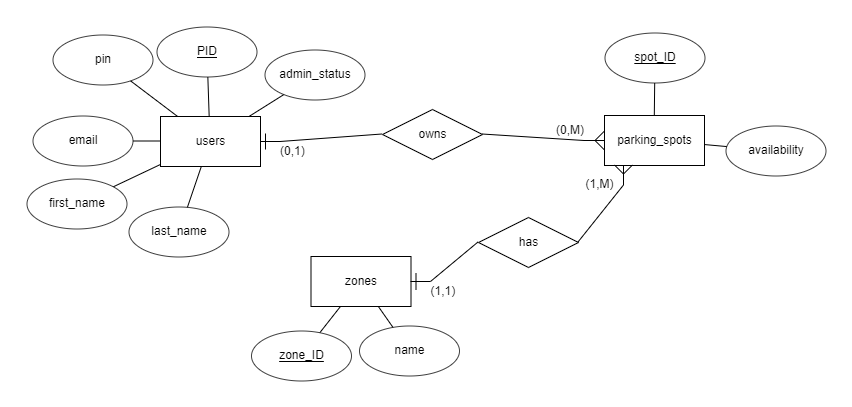
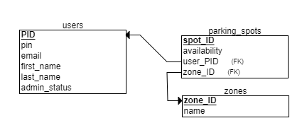

# Pylon Parking
### Systems and Networking Capstone Spring 2020

A blockchain solution for reserving parking spots

  

## How to create postgres server:
1. Make sure postgres is installed
2. Start the server, on Linux: `service postgresql start`
3. Create the database, `sudo -u postgres createdb PylonParking` *note: you have to be on the correct postgres user, https://docs.microsoft.com/en-us/windows/nodejs/databases#postgresql-user-setup*
4. Assuming the admin user is postgres, load the sql: `sudo -u postgres psql -d PylonParking -a -f install.sql`
5. Change the password of postgres to superman `sudo -u postgres psql` then `ALTER USER postgres PASSWORD 'superman';`